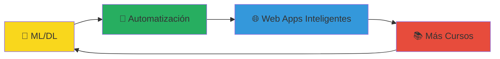

<div align="center">
  
</div>
<div align="center">
  
</div>
<div align="center">
  
</div>
<div align="center">
  <br>
</div>

## 🚀 Sobre Mí

```javascript
const ivan = {
    pronouns: "él/him",
    code: ["Python", "JavaScript", "C", "C++", "HTML", "CSS", "TypeScript"],
    askMeAbout: ["desarrollo web", "machine learning", "telecomunicaciones", "enseñanza"],
    technologies: {
        frontEnd: {
            js: ["React"],
            ts: ["React"],
            css: ["Tailwind CSS"],
        },
        backEnd: {
            python: ["FastAPI", "Flask"],
            js: ["Node.js", "Express"],
            ts: ["Node.js", "Express"]
        },
        databases: ["SQL", "MongoDB", "PostgreSQL"],
        misc: ["Firebase", "Socket.IO", "Docker"]
    },
    currentFocus: "Automatización y modelos de ML/DL 🤖",
    funFact: "¡Enseño desarrollo web Y matemáticas para ML!"
};
```


## 🎯 Lo Que Hago

<div align="center">

### 💻 **Desarrollo Full Stack**
Creo aplicaciones web completas desde la interfaz hasta el servidor

### 🎓 **Educación Tech**
Imparto cursos de desarrollo front-end, back-end y matemáticas para ML

### 🔬 **Investigación & Aprendizaje**
Siempre explorando nuevas tecnologías y creando proyectos innovadores

</div>


## 🛠️ Tech Stack

<div align="center">

### 💻 Lenguajes


### 🚀 Frameworks & Librerías


### 🗄️ Bases de Datos


### 🧠 Actualmente Aprendiendo


</div>


## 📊 Estadísticas de GitHub

<div align="center">
  


</div>

<div align="center">
  
</div>


## 🌟 Proyectos Destacados

<div align="center">

### 🎓 **Cursos de Desarrollo Web**
Cursos completos de desarrollo front-end y back-end para formar nuevos desarrolladores

### ⚡ **Leyes de Maxwell - Web Educativa**
Página interactiva que explica las fundamentales leyes de Maxwell de forma visual

### 📝 **Task Tracker CLI**
Herramienta de línea de comandos construida con Node.js para gestión de tareas

### 🎮 **Proyectos de Videojuegos**
Experimentación con desarrollo de juegos y gráficos interactivos

</div>


## 🎯 Objetivos Actuales

<div align="center">



</div>

- 🤖 **Machine Learning & Deep Learning**: Creando modelos inteligentes
- 🔄 **Automatización**: Optimizando procesos con código
- 🎓 **Educación Continua**: Expandiendo mis cursos y materiales
- 🌟 **Proyectos Innovadores**: Combinando web dev con IA


## 🎨 Mis Pasiones

<div align="center">
  
### 🎵 **Música** | 💻 **Programación** | 🎨 **Diseño** | 🔬 **Experimentación**

*"La curiosidad es el motor de todos mis proyectos"*

</div>

- 🎵 **Música**: Explorando sonidos y ritmos en mi tiempo libre
- 💻 **Código**: Siempre probando nuevas tecnologías y frameworks  
- 🎨 **Diseño**: Creando interfaces que no solo funcionen, sino que inspiren
- 🔬 **Experimentación**: Cada proyecto es una oportunidad de aprender algo nuevo


## 📈 Actividad de Contribuciones

<div align="center">
  


</div>


## 🤝 ¡Conectemos!

<div align="center">

### 💌 ¿Tienes una idea? ¡Hablemos!

[](mailto:axel-ivan24@hotmail.com)

---

### *"Cada línea de código es una oportunidad de hacer algo extraordinario"*


</div>

<div align="center">
  
</div>
