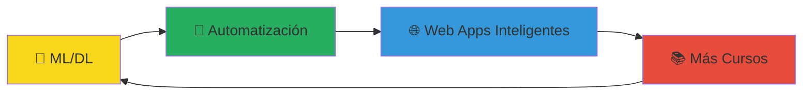

<div align="center">
  
</div>
<div align="center">
  
</div>
<div align="center">
  
</div>
<div align="center">
  <br>
</div>

## 🚀 Sobre Mí

```javascript
const ivan = {
    pronouns: "él/him",
    code: ["Python", "JavaScript", "C", "C++", "HTML", "CSS", "TypeScript", "Rust", "Swift"],
    askMeAbout: ["desarrollo web", "machine learning", "telecomunicaciones", "enseñanza"],
    technologies: {
        frontEnd: {
            js: ["React", "React-Native", "Next.js", "Astro", "Three.js", "Tanstack Start"],
            ts: ["React", "React-Native", "Next.js", "Astro", "Three.js", "Tanstack Start"],
            css: ["Tailwind CSS", "SCSS"],
        },
        backEnd: {
            python: ["FastAPI", "Flask", "Django"],
            js: ["Node.js", "Express", "NestJS"],
            ts: ["Node.js", "Express", "NestJS"]
        },
        databases: ["SQL", "MongoDB", "PostgreSQL", "MariaDB"],
        misc: ["Firebase", "Socket.IO", "Docker", "Kubernetes", "Kafka", "MQRabbit"]
    },
    currentFocus: "Automatización y modelos de ML/DL 🤖",
    funFact: "¡Enseño desarrollo web Y matemáticas para ML!"
};
```


## 🎯 Lo Que Hago

<div align="center">

### ⚙️ **Staff Engineer**
Lidero la arquitectura técnica y la toma de decisiones estratégicas para escalar productos de alto impacto.

### 💻 **Desarrollo Full Stack**
Creo aplicaciones web completas desde la interfaz hasta el servidor

### 🎓 **Educación Tech**
Imparto cursos de desarrollo front-end, back-end y matemáticas para ML

### 🔬 **Investigación & Aprendizaje**
Siempre explorando nuevas tecnologías y creando proyectos innovadores


</div>


## 🛠️ Tech Stack

<div align="center">

### 💻 Lenguajes


### 🚀 Frameworks & Librerías


### 🗄️ Bases de Datos


### 🧠 Actualmente Aprendiendo


</div>


## 📊 Estadísticas de GitHub

<div align="center">

<a href="https://git.io/streak-stats"></a>

</div>


## 🌟 Proyectos Destacados

<div align="center">

### 🩺 **Aura**
SaMD + SaaS orientado a salud digital, diseñado para monitoreo clínico con telemetría en tiempo real, alertas tempranas y seguimiento médico-paciente.
`React` `React Native` `Python` `Rust` `PostgreSQL` `AI`

### 🛠️ **Serviya**
Plataforma de oportunidades para oficios y trabajos prácticos, pensada para conectar talento independiente y estudiantes con oportunidades reales de ingreso.
`React` `TanStack Router` `Express.js` `TypeScript` `PostgreSQL`

### 📦 **Minibodegas**
SaaS B2B para la gestión de bodegas, enfocado en clientes, espacios, operadores y contratos con una experiencia clara y escalable.
`React` `TanStack Router` `Express.js` `TypeScript` `PostgreSQL`

### 🏛️ **SIGI**
Proyecto de migración para un entorno institucional de alta responsabilidad, enfocado en continuidad operativa, modernización tecnológica y confiabilidad en procesos críticos.
`React` `React Router v7` `Express.js` `TypeScript` `PostgreSQL`

### ⚡ **[Curso Next + TypeScript](https://github.com/XxIvanstromxX/Curso-Next-TypeScript)**
Curso avanzado centrado en llevar aplicaciones de Next.js a un nivel más profesional con TypeScript, mejor estructura y una base más sólida para escalar.
`Next.js` `React` `TypeScript` `Arquitectura`

</div>


## 🎯 Objetivos Actuales

<div align="center">


```mermaid
graph LR
    A[🤖 ML/DL] --> B[🔄 Automatización]
    B --> C[🌐 Web Apps Inteligentes]
    C --> D[📚 Más Cursos]
    D --> A
    style A fill:#f9d71c
    style B fill:#27ae60
    style C fill:#3498db
    style D fill:#e74c3c
```

</div>

- 🤖 **Machine Learning & Deep Learning**: Creando modelos inteligentes
- 🔄 **Automatización**: Optimizando procesos con código
- 🎓 **Educación Continua**: Expandiendo mis cursos y materiales
- 🌟 **Proyectos Innovadores**: Combinando web dev con IA


## 🎨 Mis Pasiones

<div align="center">
  
### 🎵 **Música** | 💻 **Programación** | 🎨 **Diseño** | 🔬 **Experimentación**

*"La curiosidad es el motor de todos mis proyectos"*

</div>

- 🎵 **Música**: Explorando sonidos y ritmos en mi tiempo libre
- 💻 **Código**: Siempre probando nuevas tecnologías y frameworks  
- 🎨 **Diseño**: Creando interfaces que no solo funcionen, sino que inspiren
- 🔬 **Experimentación**: Cada proyecto es una oportunidad de aprender algo nuevo


## 📈 Actividad de Contribuciones

<div align="center">
  


</div>


## 🤝 ¡Conectemos!

<div align="center">

### 💌 ¿Tienes una idea? ¡Hablemos!

[](mailto:axel-ivan24@hotmail.com)

---

### *"Cada línea de código es una oportunidad de hacer algo extraordinario"*


</div>

<div align="center">
  
</div>
